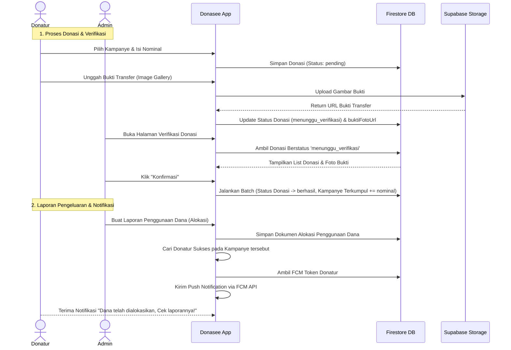

# Ringkasan Aplikasi Donasee

**Donasee** adalah aplikasi mobile berbasis **Flutter** yang dirancang sebagai platform donasi digital untuk membantu panti asuhan menggalang dana secara transparan dan akuntabel. Aplikasi ini mengintegrasikan dua backend utama, yaitu **Firebase** (untuk autentikasi, database real-time, dan notifikasi) serta **Supabase** (untuk penyimpanan gambar/media secara cloud).

---

## 🛠️ Tech Stack & Dependensi Utama

Aplikasi ini dibangun menggunakan modul-modul berikut (seperti tercantum pada [pubspec.yaml](file:///d:/Kuliah/Smt%206/Mobile/donasee_final_project_ppb/pubspec.yaml)):

1. **Flutter SDK**: `>=3.11.4 <4.0.0` dengan Material Design 3.
2. **Autentikasi & Database Utama**:
   - `firebase_core` & `firebase_auth`: Manajemen sesi masuk dan pendaftaran pengguna.
   - `cloud_firestore`: Database NoSQL real-time untuk menyimpan data pengguna, kampanye, donasi, dan alokasi dana.
3. **Penyimpanan Gambar (Cloud Storage)**:
   - `supabase_flutter`: Digunakan khusus untuk mengunggah dan mengelola berkas media (gambar kampanye dan foto bukti transfer) melalui Supabase Storage Bucket.
4. **Notifikasi**:
   - `firebase_messaging`: Pengiriman Push Notification berbasis token perangkat (FCM) kepada donatur ketika ada kabar alokasi dana.
5. **State Management & Utilitas**:
   - `provider`: Digunakan untuk menyediakan dependensi global seperti `AuthService` ke seluruh widget tree.
   - `http`: Melakukan request API eksternal (mengambil nilai tukar mata uang dan memicu HTTP POST ke API Firebase Messaging).
   - `image_picker`: Memilih foto bukti transfer atau gambar sampul kampanye dari galeri ponsel.
   - `intl`: Melokalisasi format tanggal dan angka mata uang Rupiah (`id_ID`).

---

## 📂 Struktur Direktori Kode (`/lib`)

Berikut adalah struktur folder utama beserta penjelasannya:

```text
lib/
├── firebase_options.dart      # Konfigurasi platform Firebase
├── main.dart                  # Titik masuk aplikasi & Inisialisasi Firebase/Supabase
├── models/                    # Model data (Struktur representasi objek)
│   ├── allocation_model.dart
│   ├── campaign_model.dart
│   ├── donation_model.dart
│   └── user_model.dart
├── services/                  # Logika bisnis & Interaksi API/Database
│   ├── allocation_service.dart
│   ├── auth_service.dart
│   ├── campaign_service.dart
│   ├── donation_service.dart
│   ├── exchange_rate_service.dart
│   ├── image_upload_service.dart
│   └── notification_service.dart
├── widgets/                   # Komponen visual yang reusable
│   ├── allocation_card.dart
│   ├── campaign_card.dart
│   ├── donation_card.dart
│   └── status_badge.dart
└── screens/                   # Halaman / Tampilan Antarmuka Aplikasi
    ├── admin/                 # Fitur khusus Admin Panti Asuhan
    ├── auth/                  # Halaman Login, Register & Auth Wrapper
    ├── donasiku/              # Riwayat Donasi & Form Donasi Donatur
    ├── home/                  # Halaman Utama (Jelajah Kampanye & Navigasi)
    ├── kabar/                 # Kabar Baik (Laporan Alokasi Penggunaan Dana)
    ├── kampanye/              # Detail, Pembuatan, & Edit Kampanye
    └── profil/                # Informasi Akun, Riwayat Statistik, & Logout
```

---

## 👥 Aktor & Sistem Peran (Role-Based Access)

Aplikasi memiliki dua jenis peran pengguna:

1. **Donatur (Donor)**:
   - Menjelajahi berbagai kampanye aktif.
   - Melakukan donasi (memilih nominal & metode transfer bank).
   - Mengunggah foto bukti transfer.
   - Melihat riwayat transaksi donasi pribadinya.
   - Menerima notifikasi dan membaca laporan penggunaan dana ("Kabar Baik").
2. **Admin Panti Asuhan (Admin)**:
   - Membuat, menyunting, dan menghapus kampanye penggalangan dana milik pantinya sendiri.
   - Memverifikasi donasi masuk yang berstatus `menunggu_verifikasi` (dengan memeriksa kesesuaian nominal dan bukti transfer).
   - Menulis laporan pertanggungjawaban penggunaan dana yang telah terkumpul ("Alokasi Dana" / "Kabar Baik").
   - Memantau ringkasan statistik kampanye yang sedang berjalan.

---

## 📄 Penjelasan Model Data (`/lib/models`)

- **[user_model.dart](file:///d:/Kuliah/Smt%206/Mobile/donasee_final_project_ppb/lib/models/user_model.dart) (`UserModel`)**
  Representasi pengguna. Menyimpan `uid`, `email`, `nama`, `role` (`'donatur'` / `'admin'`), `fcmToken` (untuk push notification), `organisasiNama` (nama panti asuhan jika admin), dan `createdAt`.
  
- **[campaign_model.dart](file:///d:/Kuliah/Smt%206/Mobile/donasee_final_project_ppb/lib/models/campaign_model.dart) (`CampaignModel`)**
  Representasi penggalangan dana. Menyimpan target dana (`targetDana`), dana terkumpul (`terkumpul`), batas tanggal (`batasTanggal`), pembuat (`organisasiId`), nama panti (`organisasiNama`), status (`'aktif'` / `'selesai'`), serta URL gambar sampul (`imageUrl`) yang diunggah ke Supabase.
  
- **[donation_model.dart](file:///d:/Kuliah/Smt%206/Mobile/donasee_final_project_ppb/lib/models/donation_model.dart) (`DonationModel`)**
  Representasi transaksi donasi. Menyimpan `nominal`, `buktiFotoUrl` (dari Supabase Storage), `status` (`pending`, `menunggu_verifikasi`, `berhasil`), metode pembayaran, serta relasi ID kampanye & ID donatur.

- **[allocation_model.dart](file:///d:/Kuliah/Smt%206/Mobile/donasee_final_project_ppb/lib/models/allocation_model.dart) (`AllocationModel`)**
  Representasi laporan pengeluaran dana. Menyimpan `judulAlokasi`, `deskripsi` pengeluaran, `nominal` dana yang digunakan, tanggal alokasi, serta ID admin pembuat laporan.

---

## ⚙️ Cara Kerja Layanan & API (`/lib/services`)

- **[auth_service.dart](file:///d:/Kuliah/Smt%206/Mobile/donasee_final_project_ppb/lib/services/auth_service.dart)**:
  Membungkus Firebase Auth. Saat registrasi, data profil tambahan disimpan ke Firestore koleksi `users`. Saat login, aplikasi memicu pembaharuan FCM Token perangkat.
- **[campaign_service.dart](file:///d:/Kuliah/Smt%206/Mobile/donasee_final_project_ppb/lib/services/campaign_service.dart)**:
  Mengatur CRUD data kampanye di Firestore. Memiliki metode `checkAndClose()` yang otomatis mengubah status kampanye menjadi `selesai` jika dana yang terkumpul telah menyamai atau melebihi target dana.
- **[donation_service.dart](file:///d:/Kuliah/Smt%206/Mobile/donasee_final_project_ppb/lib/services/donation_service.dart)**:
  - Menyimpan transaksi donasi baru.
  - Menyediakan fitur unggah foto bukti pembayaran ke bucket Supabase `bukti-transfer`.
  - **Transaksi Batch**: Di dalam metode `konfirmasiDonasi()`, Firestore Batch memproses perubahan status donasi menjadi `berhasil` sekaligus menambah/increment nilai `terkumpul` pada dokumen kampanye terkait secara atomik.
- **[allocation_service.dart](file:///d:/Kuliah/Smt%206/Mobile/donasee_final_project_ppb/lib/services/allocation_service.dart)**:
  Mengatur CRUD laporan pengeluaran dana kampanye di Firestore koleksi `allocations`.
- **[image_upload_service.dart](file:///d:/Kuliah/Smt%206/Mobile/donasee_final_project_ppb/lib/services/image_upload_service.dart)**:
  Mengunggah cover kampanye ke bucket Supabase `campaign-images` dan menghasilkan tautan publik. Layanan ini juga menangani penghapusan gambar lama dari Supabase ketika kampanye dihapus.
- **[exchange_rate_service.dart](file:///d:/Kuliah/Smt%206/Mobile/donasee_final_project_ppb/lib/services/exchange_rate_service.dart)**:
  Mengambil data kurs mata uang real-time IDR ke USD dari API publik `https://open.er-api.com/v6/latest/IDR` secara asinkron. Ini memberikan estimasi nilai donasi dalam USD ketika donatur mengetikkan nominal Rupiah.
- **[notification_service.dart](file:///d:/Kuliah/Smt%206/Mobile/donasee_final_project_ppb/lib/services/notification_service.dart)**:
  Meminta izin notifikasi perangkat, memperbarui FCM token di database, serta mengirim push notification lewat request HTTP POST ke endpoint legacy Google FCM kepada semua donatur yang transaksi donasinya berstatus `berhasil` pada kampanye terkait, segera setelah admin memposting alokasi dana baru.

---

## 🔄 Alur Fitur Utama Aplikasi



---

## 🎨 Desain & Antarmuka Pengguna (UI)

- **Warna Identitas Utama**: Hijau Toska (`#1D9E75`) memberikan kesan terpercaya, aman, dan segar untuk platform sosial/donasi.
- **Navigasi Utama**: Memanfaatkan [main_navigation.dart](file:///d:/Kuliah/Smt%206/Mobile/donasee_final_project_ppb/lib/screens/home/main_navigation.dart) dengan `IndexedStack` guna menjaga performa saat berpindah tab.
- **Pengurutan & Filter**: Halaman Jelajah menyediakan opsi pengurutan kampanye secara dinamis (Terbaru vs. Terdesak/sisa hari paling sedikit) serta filter "Milik Saya" khusus untuk Admin agar dapat mengelola kampanye buatannya sendiri dengan mudah.
